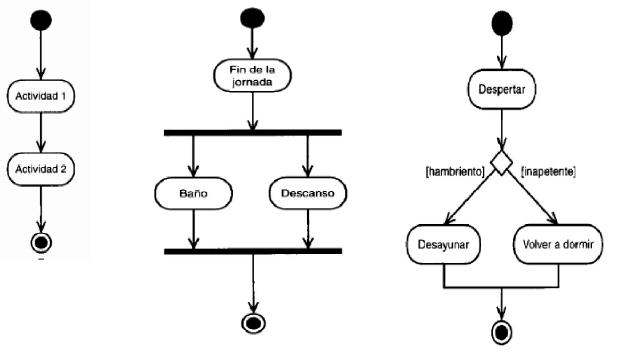

# Diagrama de Actividad

El diagrama de actividad es como un flujograma que muestra **el paso a paso de un proceso** dentro del sistema.  
Sirve para ver cómo se comporta el sistema cuando pasa algo, y qué caminos puede seguir según las decisiones que se tomen.

---

##  Utilidad

- Se utiliza para **visualizar procesos** desde que empiezan hasta que terminan.
- También, para entender **qué hace el sistema en cada paso**.
- Para ver las distintas **ramas o decisiones** que puede tomar el flujo.

---

## ¿Qué contiene?

- **Actividades:** lo que se va haciendo paso a paso.
- **Flechas:** muestran la dirección del flujo.
- **Condiciones o decisiones:** cuando hay que elegir un camino u otro.
- **Inicio y fin:** siempre empieza con un punto negro y termina con un círculo con borde.

---

## Ejemplo simple de un sistema de gimnasio

- Inicio.
- Inicia sesión el usuario.
- Se valida usuario y contraseña.
- Si es cliente, muestra su rutina y estadísticas.
- Si es administrativo, muestra opciones para crear rutina o modificar clientes.
- Fin.

