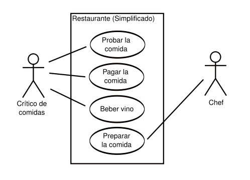

 # Diagrama de Casos de Uso

El diagrama de casos de uso es una forma visual de mostrar **qué puede hacer un usuario en un sistema**.  
Representa a los "actores". es decir, los usuarios que interactúan con la app, así como tambien las **acciones principales** que pueden realizar.

---

## ¿Para qué sirve?

- Prinicipalmente, para **entender claramente lo que el sistema debe permitir hacer**.
- Para tener una visión general de las **funciones clave desde el punto de vista del usuario**.
- Para detectar funciones que pueden llegar a faltar o en todo caso, sobrar.

---

## ¿Qué se ve en un diagrama de casos de uso?

- **Actores**: pueden ser personas, otro sistema, o cualquier cosa que interactúe.
- **Casos de uso**: las funcionalidades principales.
- **Flechas**: conectan actores con casos de uso.

---

## Ejemplo adaptado a nuestro trabajo: Sistema de Gestión de Gimnasio

### Actores:
- Cliente.
- Administrativo.

### Casos de uso del Cliente:
- Consultar rutina.
- Modificar datos personales.
- Ver estadísticas.
- Consultar tiempo de permanencia.
- Ver sedes disponibles.

### Casos de uso del Administrativo:
- Crear rutina.
- Crear nuevo cliente.
- Dar de baja cliente.

## Ejemplo visual de diagrama de casos de uso

En la siguiente imagen podemos observar de forma muy clara un simple ejemplo de este tipo de diagrama donde los dos actores que se involucran, donde cada uno esta conectado con sus casos de uso. El crítico de comidas se encarga de las primeras tres acciones mientras que el chef solo de la última.
En un ejemplo más completo podríamos agrerar meseros, lavaplatos, cajeros y demás actores participantes en un restaurante, pero para entender la idea está más que bien. 

