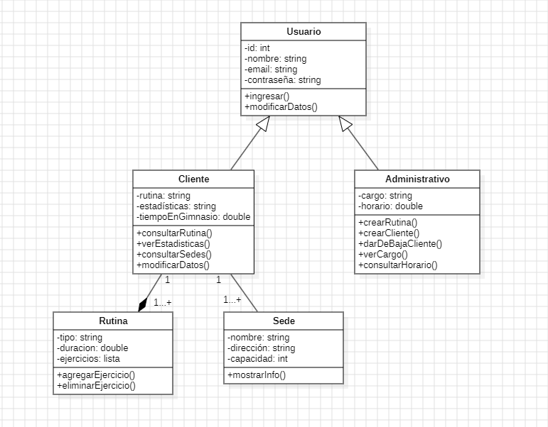

# Diagrama de Clases – Sistema de Gestión de Gimnasio

El diagrama de clases representa las clases principales del sistema, sus atributos, métodos y relaciones entre ellas.  
El siguiente ejemplo abarca un sistema de gestión de gimnasio, con enfoque en la gestión de usuarios clientes y administrativos.

---

## Clases del sistema:

### 1) Usuario *(clase abstracta)*
- Atributos: id, nombre, email, contraseña.
- Métodos: ingresar(), modificarDatos()

Esta clase representa a cualquier usuario del sistema.

---

### 2) Cliente *(hereda de Usuario)*
- Atributos: rutina, estadisticas, tiempoEnGimnasio.
- Métodos: consultarRutina(), verEstadisticas(), consultarSedes(), modificarDatos()

Puede consultar su rutina, ver estadísticas, modificar datos, revisar el tiempo que pasó en el gimnasio y consultar las sedes disponibles.

---

### 3) Administrativo *(hereda de Usuario)*
- Atributos: id, nombre, cargo, horario.
- Métodos: crearRutina(cliente), crearCliente(), darDeBaja(cliente)

Puede crear rutinas para los clientes, registrar nuevos clientes y dar de baja clientes existentes.

---

### 4) Rutina
- Atributos: tipo, duración, ejercicios[]
- Métodos: agregarEjercicio(), eliminarEjercicio()

Representa una rutina asignada a un cliente.

---

### 5) Sede
- Atributos: nombre, dirección, capacidad
- Métodos: mostrarInfo()

Representa una sucursal del gimnasio.

