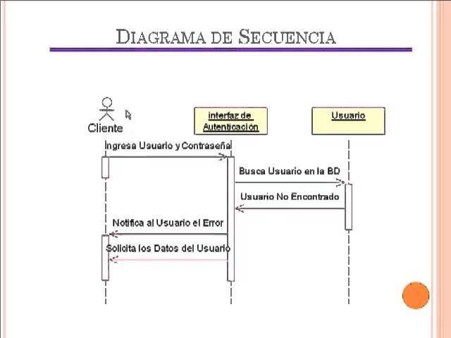

# Diagrama de Secuencia

El diagrama de secuencia sirve para **mostrar cómo se comunican los objetos entre sí a lo largo del tiempo**.  
Es ideal para ver el paso a paso de una acción específica, como si fueran mensajes que se mandan entre objetos.

---

## Ulitidad

- Se utlitiza para entender **qué objetos participan** en una acción y en qué orden lo hacen.
- También permite ver cómo se da **la interacción entre clases o módulos**.
- Para representar procesos **concretos** como: login, alta de usuario, compra, etc.

---

## ¿Qué contiene?

- **Objetos o clases:** son los que intervienen en el proceso (usuario, sistema, base de datos, etc).
- **Líneas de vida:** representan el tiempo en que cada objeto está activo.
- **Mensajes:** son flechas con texto que muestran qué le dice un objeto a otro (por ejemplo: `validarDatos()`)
- **Retornos:** son las respuestas a esos mensajes, con datos, confirmaciones o negaciones.

---

## Ejemplo: ingreso de usuario en el sistema del gimnasio

1. El **usuario** ingresa usuario y contraseña.
2. El sistema le manda esos datos a la clase **Autenticador**.
3. El autenticador los valida con la **Base de Datos**.
4. Si los datos son correctos, se permite el acceso.
5. El sistema responde al usuario con "Bienvenido" o "Acceso denegado".

## Ejemplo visual de diagrama de secuencia

En este ejemplo se explica claramente el desarollo de el programa seleccionado a lo largo del tiempo, tomando solamente la funcion de inicio de sesión con usuario y contraseña, y como por cada cliente que lo intente la interfaz de autenticación ira a la base de datos a verificar si ambos datos con correctos, si alguno de los dos no es correcto, si ambos no son correctos o si el usuario no existe todavía. En este caso el retorno es una notificación hacia el cliente de que el usuario no fue encontrado, así como la interfaz solicita nuevamente los datos del usario para volver a intentar, aunque podriamos también agregar una función que nos lleve a la creación un nuevo usuario. 

